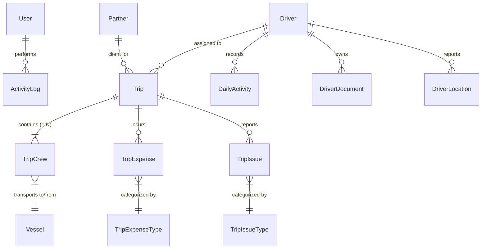

# ManageTrans — Project Architecture & AI Agent Guide

ManageTrans is a web-based **Transportation & Fleet Management System** built with **Laravel 12 (PHP 8.2+)**. It features a comprehensive **Web Admin Panel** for dispatchers/managers and a **RESTful Mobile API** for field drivers using Laravel Sanctum, AWS Textract OCR, and Firebase Cloud Messaging (FCM).

---

## 🛠️ Technology Stack

| Layer | Technology |
| :--- | :--- |
| **Backend Framework** | Laravel 12 (PHP 8.2+) |
| **Authentication** | Session-based (Web Staff), Laravel Sanctum Tokens (Driver Mobile App) |
| **Database** | SQLite (Default Dev) / MySQL / PostgreSQL |
| **Cloud & Services** | AWS Textract (Manifest OCR extraction), Firebase Cloud Messaging (Push Notifications) |
| **Frontend** | Blade Templates, Vanilla JS, Bootstrap CSS, Vite |
| **Logging & Audit** | Custom `LogsActivity` trait & `activity_logs` table |

---

## 📁 Directory & File Structure

```
manage-trans/
├── app/
│   ├── Http/
│   │   ├── Controllers/
│   │   │   ├── Api/                     # Driver Mobile API Controllers
│   │   │   │   ├── DriverAuthController.php
│   │   │   │   ├── HomeController.php
│   │   │   │   ├── NotificationController.php
│   │   │   │   └── TripController.php   # API endpoints for schedule, status, expenses, issues
│   │   │   ├── ActivityLogController.php
│   │   │   ├── AuthController.php
│   │   │   ├── DailyActivityController.php
│   │   │   ├── DashboardController.php
│   │   │   ├── DriverController.php
│   │   │   ├── NotificationController.php
│   │   │   ├── PartnerController.php
│   │   │   ├── PermissionController.php
│   │   │   ├── ProfileController.php
│   │   │   ├── PublicPagesController.php
│   │   │   ├── ReportController.php
│   │   │   ├── SettingsController.php
│   │   │   ├── StaffController.php
│   │   │   ├── TripController.php       # Admin web trip management & AWS Textract workflow
│   │   │   ├── TripExpenseTypeController.php
│   │   │   ├── TripIssueTypeController.php
│   │   │   └── VesselController.php
│   ├── Models/
│   │   ├── ActivityLog.php              # System audit trail
│   │   ├── DailyActivity.php            # Driver daily log & vehicle mileage tracker
│   │   ├── Driver.php                   # Driver profiles & auth credentials
│   │   ├── DriverDocument.php           # Driver IDs, licenses, documents
│   │   ├── DriverLocation.php           # Driver GPS coordinates
│   │   ├── Notification.php             # System & FCM push notifications
│   │   ├── Partner.php                  # Client/agency partners
│   │   ├── Permission.php               # Granular RBAC permissions
│   │   ├── RolePermission.php           # Role-based permission mapping
│   │   ├── Trip.php                     # Core Trip entity
│   │   ├── TripCrew.php                 # Individual crew transport jobs (1 Trip : N Crews)
│   │   ├── TripExpense.php              # Trip monetary expense submissions
│   │   ├── TripExpenseType.php          # Expense categories (Fuel, Toll, Parking, etc.)
│   │   ├── TripIssue.php                # Operational issue reports
│   │   ├── TripIssueType.php            # Issue categories (Breakdown, Traffic, etc.)
│   │   ├── User.php                     # Admin/Staff web users
│   │   ├── UserPermission.php           # Direct user permission overrides
│   │   └── Vessel.php                   # Maritime vessel entities
│   ├── Services/
│   │   ├── FirebaseNotificationService.php  # Push notification service via FCM
│   │   └── TextractService.php              # AWS Textract document OCR table parsing
│   └── Traits/
│       └── LogsActivity.php             # Auto-auditing model events
├── database/
│   └── migrations/                      # Database schema migrations
├── resources/
│   └── views/
│       ├── daily-activities/
│       ├── drivers/
│       ├── notifications/
│       ├── partners/
│       ├── reports/
│       ├── staff/
│       ├── trips/                       # Trip index, create, edit, show, review-extraction
│       └── vessels/
├── routes/
│   ├── api.php                          # Driver mobile API routes (Sanctum protected)
│   └── web.php                          # Admin web portal routes (RBAC permission middleware)
├── AGENTS.md                            # AI Agent Workspace Rules & System Map
└── PROJECT.md                           # Comprehensive Architecture & Documentation
```

---

## 🗄️ Database Entity-Relationship (ER) Overview



---

## ⚙️ Key Core Modules

### 1. Trip Module
* **Parent-Child Architecture**: A `Trip` represents a single scheduled driver dispatch for a given date and partner. Each `Trip` contains multiple `TripCrew` records (individual crew member pickup/drop locations, pickup times, flight numbers, and vessel links).
* **Trip Status Workflow**:
  * `unassigned` $\rightarrow$ `assigned` $\rightarrow$ `in_progress` $\rightarrow$ `completed` $\rightarrow$ `cancelled`.
  * **Cancellation Handling**: Dispatchers can cancel trips (`POST /trips/{id}/cancel`). Cancelled trips are visually highlighted with red borders/badges on `/trips`, tracked in statistics cards, and excluded from operational reports by default.
* **Title Auto-Generation**: Automatic title formatting (`"Trip 1"`, `"Trip 2"`, etc.) generated per driver per date via `Trip::generateTripTitle()`.
* **AWS Textract Manifest OCR**:
  * Dispatchers upload PDF/Image manifest files.
  * `TextractService` parses table headers and rows.
  * Extracted data is presented on `trips/review-extraction.blade.php` to review, map drivers/vessels, and execute `storeBulk` creation.

### 2. Configurable Trip Expense Types & Dynamic Reporting
* **Multi-Option Input Configuration**: `TripExpenseType` supports configurable input types (`amount`, `hours`, `text`, `image`). Hour-based expense entries (e.g. `Waiting Charge`) store decimal values in `trip_expenses.hours`.
* **Dynamic Summary Report (`/reports/trip-summary`)**:
  * Dynamically generates table columns for all active `TripExpenseType` categories (`Charge (...)`).
  * Computes total `Amount`, `Actual(-20%) Charged to OMS` (`Amount * 0.80`), and concatenated `COMMENTS`.
  * Web view cleanly displays up to `Sub Remark`, while Excel & PDF exports dynamically export all dynamic charge columns, `Amount`, `Actual(-20%)`, and `COMMENTS` header at the end.

### 3. Driver & Vehicle Mileage Tracking
* Drivers log daily mileage via `DailyActivity`.
* The system automatically tracks total accumulated kilometers (`total_kilometers`).
* Every 10,000 km milestone triggers a vehicle service notification sent directly to the driver via FCM.

### 4. Role-Based Access Control (RBAC)
* Handled via `permission:...` middleware in `routes/web.php`.
* Permissions include `view_trips`, `create_trips`, `edit_trips`, `delete_trips`, `view_drivers`, `view_reports`, `manage_permissions`, etc.

### 5. Push Notifications & Application-Wide Audit Logging
* Firebase FCM integration (`FirebaseNotificationService`) sends real-time push alerts to mobile devices on trip assignment or mileage milestones.
* System-wide activity logging (`LogsActivity`) attached to all application models (`Trip`, `TripCrew`, `TripExpense`, `TripIssue`, `Driver`, `DailyActivity`, `User`, `Partner`, `Vessel`, `TripExpenseType`, `TripIssueType`, `Notification`), recording actions with safe array string formatting and user/driver attribution.

---

## 🌐 API Reference (Driver Mobile App)

All API endpoints are under `/api/` and require `Authorization: Bearer <sanctum_token>` except authentication endpoints.

| Method | Endpoint | Description |
| :--- | :--- | :--- |
| `POST` | `/api/login` | Driver login (returns Sanctum token) |
| `GET` | `/api/schedule` | Today's driver trips grouped by `pending`, `ongoing`, and `completed` |
| `GET` | `/api/trips/{id}` | Detailed trip information (crews, locations, issues, expenses, status flags) |
| `PUT` | `/api/trips/{id}/status` | Update trip status (`assigned`, `in_progress`, `completed`, `cancelled`) |
| `PUT` | `/api/trips/{id}/crew/{crew_id}` | Update crew contact or location details |
| `GET` | `/api/trip-issue-types` | Fetch list of valid issue types |
| `POST` | `/api/trips/{id}/issues` | Submit trip issue report |
| `GET` | `/api/trip-expense-types` | Fetch list of valid expense types with input rules (`amount`, `hours`, `text`, `image`) |
| `POST` | `/api/trips/{id}/expenses` | Submit trip expense with amount, hours, notes, and receipt image |
| `GET` | `/api/daily-activity` | View today's daily activities and total kilometers |
| `POST` | `/api/daily-activity` | Log daily activity / driven kilometers |
| `POST` | `/api/location/update` | Update driver current GPS location |
| `POST` | `/api/notification-token/update` | Register/Update FCM device push token |

---

## 🚀 Development & Commands

```bash
# Install PHP & JS dependencies
composer install
npm install

# Run database migrations
php artisan migrate

# Start local server + queue worker + Vite bundler
composer run dev

# Run test suite
composer test
```

---

## 🤖 Guidelines for AI Agents (Cursor, Antigravity, Copilot, etc.)

1. **Preserve Database Contracts**:
   * Note that `status` resides on the `trips` table (previously on `trip_crews`). Always query `$trip->status`.
   * A `Trip` can have multiple `TripCrew` children (`$trip->crews`).
2. **Audit Logging Integrity**:
   * When performing bulk or background updates from drivers, use `saveQuietly()` if adding explicit manual `ActivityLog` entries to avoid duplicate log entries.
3. **Relationships & Eager Loading**:
   * Always eager load relationships (`with(['driver', 'crews.vessel'])`) when fetching lists to avoid $N+1$ query issues.
4. **Validation & Permissions**:
   * Always enforce permission middleware in `routes/web.php` when adding new web endpoints.
   * Validate driver parameters in `routes/api.php`.
