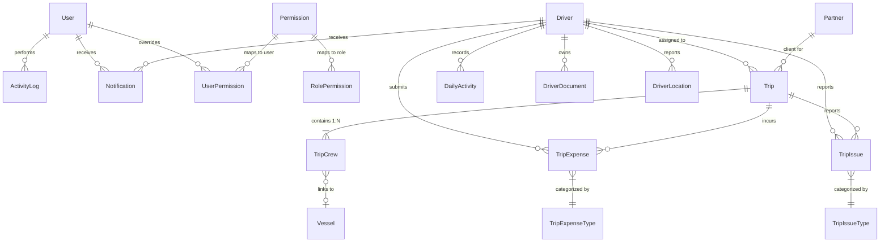

# ManageTrans — Project Architecture & AI Agent Guide

ManageTrans is a **Transportation & Fleet Management System** built with **Laravel 12 (PHP 8.2+)**. It provides a **Web Admin Panel** for dispatchers/managers and a **RESTful Mobile API** for field drivers (Laravel Sanctum), with AWS Textract OCR and Firebase Cloud Messaging (FCM).

*Core project guide last broadly verified: July 27, 2026. Partner Portal supplement verified: August 20, 2026. See [PARTNER_PORTAL.md](./PARTNER_PORTAL.md) for current Partner Portal architecture/contracts.*

---

## Technology Stack

| Layer | Technology |
| :--- | :--- |
| **Backend** | Laravel 12 (PHP 8.2+) |
| **Auth (Web)** | Session-based (`User` — Admin / Staff) |
| **Auth (Mobile)** | Laravel Sanctum Bearer tokens (`Driver`) |
| **Database** | SQLite (default local) / MySQL / PostgreSQL |
| **Cloud** | AWS Textract (manifest OCR), Firebase FCM (`kreait/firebase-php`) |
| **Frontend** | Blade + Bootstrap (Velzon theme in `public/assets/`), Vite + Tailwind 4 (minimal) |
| **Install** | Installable web app (manifest + service worker) for phone home screens and desktop |
| **Audit** | `LogsActivity` trait → `activity_logs` table |
| **Helpers** | `app/helpers.php` — `getSetting()`, `updateSetting()`, `getAppTimezone()`, `formatDate()`, `brandingUrl()`, `assetVersioned()` |

---

## Directory Structure

```
manage-trans/
├── app/
│   ├── Exports/                         # Placeholder (empty)
│   ├── Http/
│   │   ├── Controllers/
│   │   │   ├── Api/                     # Driver mobile API
│   │   │   │   ├── DriverAuthController.php
│   │   │   │   ├── HomeController.php
│   │   │   │   ├── NotificationController.php
│   │   │   │   └── TripController.php
│   │   │   ├── ActivityLogController.php
│   │   │   ├── AuthController.php
│   │   │   ├── DailyActivityController.php
│   │   │   ├── DashboardController.php
│   │   │   ├── DriverController.php
│   │   │   ├── NotificationController.php
│   │   │   ├── PartnerController.php
│   │   │   ├── PermissionController.php
│   │   │   ├── ProfileController.php
│   │   │   ├── PublicPagesController.php
│   │   │   ├── ReportController.php
│   │   │   ├── SettingsController.php
│   │   │   ├── StaffController.php
│   │   │   ├── TripController.php       # Web trips + Textract OCR
│   │   │   ├── TripExpenseTypeController.php
│   │   │   ├── TripIssueTypeController.php
│   │   │   └── VesselController.php
│   │   └── Middleware/
│   │       └── CheckPermission.php      # Alias: permission
│   ├── Models/                          # 18 Eloquent models (see below)
│   ├── Services/
│   │   ├── FirebaseNotificationService.php
│   │   └── TextractService.php
│   ├── Traits/
│   │   ├── HasPermissions.php           # User RBAC resolution + cache
│   │   └── LogsActivity.php
│   └── helpers.php
├── database/
│   ├── migrations/
│   └── seeders/
│       ├── DatabaseSeeder.php           # Settings + TripExpenseTypes + test user
│       ├── PermissionSeeder.php         # Run manually (not in DatabaseSeeder)
│       ├── PartnerSeeder.php
│       ├── SettingsSeeder.php
│       └── TripExpenseTypeSeeder.php
├── resources/views/                     # Blade modules (Velzon layout)
├── routes/
│   ├── api.php                          # Driver API (Sanctum)
│   └── web.php                          # Admin panel (auth + permissions)
├── AGENTS.md
├── PROJECT.md
└── README.md
```

---

## Database Entity-Relationship Overview



### Core schema notes

| Table | Role |
| :--- | :--- |
| `trips` | Dispatch header: `driver_id` (nullable), `partner_id` (nullable), `trip_date`, `title`, **`status`** |
| `trip_crews` | Passenger/leg details (1 Trip : N Crews): vessel, pickup time, locations, flight, remarks |
| `drivers` | Mobile auth accounts; `type` (1=Internal, 2=Outsourcing); `total_kilometers`; FCM `notification_token` |
| `users` | Web staff; `role` (1=Admin, 2=Staff) |
| `settings` | Key/value app config (no Eloquent model — use helpers) |
| `driver_locations` | One row per driver (`driver_id` unique) |

**Critical:** Trip status lives on `trips.status` only. Do **not** read/write status on `trip_crews`. Status constants are defined on `TripCrew` for backward compatibility (`unassigned`, `assigned`, `in_progress`, `completed`, `cancelled`).

---

## Models (`app/Models/`)

| Model | Key relationships / notes |
| :--- | :--- |
| `Trip` | `driver()`, `partner()`, `crews()`, `tripIssues()`, `tripExpenses()`; `generateTripTitle()` |
| `TripCrew` | `trip()`, `vessel()`; status constants only (no status column in fillable) |
| `Driver` | Sanctum `HasApiTokens`; `trips()`, `documents()`, `locations()`, `latestLocation()`, `dailyActivities()`, `notifications()` |
| `Vessel` | `name`, `contact_number`; linked via `trip_crews.vessel_id` (not directly on trips) |
| `Partner` | `title`, `is_default`; referenced by `trips.partner_id` |
| `TripExpense` / `TripExpenseType` | Types support `input_types` JSON: `amount`, `number`, `hours`, `text`, `image` |
| `TripIssue` / `TripIssueType` | Driver-submitted operational issues |
| `DailyActivity` | `kilometers_driven`, `image`, `note`, `activity_date` |
| `DriverDocument` | Uploaded license/ID files |
| `DriverLocation` | Latest GPS per driver |
| `Notification` | Staff (`user_id`) and/or driver (`driver_id`); types include `info`, `success`, `warning`, `danger`, `service_reminder` |
| `User` | `HasPermissions`; Admin bypasses all checks |
| `Permission` / `RolePermission` / `UserPermission` | RBAC matrix + per-user grant/deny overrides |
| `ActivityLog` | Polymorphic audit trail |

---

## Key Modules

### 1. Trip Module
* **Parent-child:** One `Trip` (date, driver, partner, title, status) contains many `TripCrew` rows (vessel, pickup, from/to, flight, remarks, `sub_remark`).
* **Status workflow:** `unassigned` → `assigned` → `in_progress` → `completed` / `cancelled`.
* **Cancel:** `POST /trips/{id}/cancel` (web). Cancelled trips are highlighted and excluded from operational reports by default.
* **Title auto-generation:** `Trip::generateTripTitle($driverId, $tripDate)` → `"Trip 1"`, `"Trip 2"`, …
* **AWS Textract OCR:** Upload PDF/image → `TextractService` → review (`trips/review-extraction`) → `storeBulk`. Can create drivers/vessels inline. Temp files on `local` disk `temp/` must be deleted after parse.
* **FCM:** Assigning a driver sends a push via `FirebaseNotificationService`.

### 2. Trip Expenses & Reporting
* Configurable types with dynamic `input_types`. Hour-based entries store decimals in `trip_expenses.hours`.
* Reports: `/reports/trip-summary`, `/reports/trip-expenses`, `/reports/driver-performance` (`permission:view_reports`).
* Trip summary dynamically builds columns per active expense type; exports include Amount, Actual(-20%) charged to OMS (`Amount * 0.80`), and COMMENTS.

### 3. Drivers & Mileage
* Types: Internal (`1`) / Outsourcing (`2`).
* Documents, live map (`/drivers/map`), GPS via `POST /api/location/update`.
* Daily activities (API + web index `/daily-activities`): accumulate `total_kilometers`; every **10,000 km** triggers in-app + FCM `service_reminder`.

### 4. Partners
* CRUD at `/partners`. Seeded examples include ZMI (default), OMS, TUV, etc. Optional on trips and OCR bulk import.

### 4.1 Partner Portal
* `Partner` → `PartnerUsers` → `PartnerRequests` → `PartnerRequestItems` → operational `Trips` / `TripCrews`.
* Dedicated `partner` guard; manual and image submission; private retained image source; internal review/approval.
* Identity: `REQ-XXXXXX` (submission/review history) and `TRP-XXXXXX` (live operational Trip).
* Approval groups items by Driver + date; `trips.partner_request_id` nullable (null for internal trips).
* One REQ may produce one or many TRPs. Trip is live operational state; PartnerRequest is historical submission/review state.
* Phase 6 operational integration complete (driver API, notifications, reports, lineage). Full contracts: [PARTNER_PORTAL.md](./PARTNER_PORTAL.md).

### 5. RBAC
* Middleware: `permission:{name}` → `CheckPermission`.
* Resolution (`HasPermissions`): Admin always allowed → user override (`user_permissions.granted`) → role default (`role_permissions`) → cached ~30 min.
* Seed with: `php artisan db:seed --class=PermissionSeeder` (not called by default `DatabaseSeeder`).

**Permission slugs (30):**

| Category | Permissions |
| :--- | :--- |
| dashboard | `view_dashboard` |
| trips | `view_trips`, `create_trips`, `edit_trips`, `delete_trips` |
| drivers | `view_drivers`, `create_drivers`, `edit_drivers`, `delete_drivers` |
| vessels | `view_vessels`, `create_vessels`, `edit_vessels`, `delete_vessels` |
| staff | `view_staff`, `create_staff`, `edit_staff`, `delete_staff` |
| partners | `view_partners`, `create_partners`, `edit_partners`, `delete_partners` |
| settings | `view_settings`, `edit_settings` |
| permissions | `manage_permissions` |
| logs | `view_activity_logs` |
| notifications | `view_notifications`, `create_notifications` |
| reports | `view_reports` |

**Default Staff role:** `view_dashboard`, `view_trips`, `create_trips`, `edit_trips`, `view_drivers`, `view_vessels`, `view_notifications`, `view_reports`.

### 6. Notifications & Audit
* Staff in-app notifications (`user_id`); driver in-app + FCM (`driver_id`).
* Admin can broadcast to drivers from web notifications UI.
* `LogsActivity` on domain models; for manual `ActivityLog` writes after driver API updates, use `$model->saveQuietly()` first to avoid duplicate logs.

### 7. Settings & Public Pages
* Settings keys: `app_name`, `app_logo`, `favicon`, `app_timezone`, `enable_signup`, `enable_forgot_password`.
* Render branding with `brandingUrl('app_logo', 'assets/images/logo-dark.png')`, never a bare `asset('storage/' . getSetting(...))`. Settings outlive uploaded files — storage gets cleared between environments — and the helper checks the file on disk before using its URL, falling back to a bundled asset instead of a broken image.
* Public: `/privacy-policy`, `/contact-us`.

---

## Web Routes (`routes/web.php`)

| Area | Middleware | Notable paths |
| :--- | :--- | :--- |
| Public | none | `/`, `/403`, `/privacy-policy`, `/contact-us`, `/manifest.webmanifest` |
| Guest | `guest` | `/login`, `/register`, `/password/reset` |
| Auth | `auth` | `/logout`, `/profile` |
| Dashboard | `permission:view_dashboard` | `/dashboard` |
| Drivers | driver CRUD perms | REST + `/drivers/map`, locations JSON |
| Vessels / Partners / Staff | respective CRUD perms | REST resources |
| Trips | trip CRUD perms | REST + extract/bulk-store/generate-title/cancel/assign-driver |
| Issue & expense types | trip perms | `/trip-issue-types`, `/trip-expense-types` |
| Settings | `view_settings` / `edit_settings` | `GET/PUT /settings` |
| Notifications | view/create | Index, admin list, unread, mark read, send |
| Permissions | `manage_permissions` | `/permissions` |
| Activity logs | `view_activity_logs` | `/activity-logs` |
| Reports | `view_reports` | `/reports/*` |
| Daily activities | `view_drivers` | `GET /daily-activities` |

---

## API Reference (Driver Mobile App)

Base path: `/api/`. Auth: `Authorization: Bearer <sanctum_token>` except public routes.

**Standard JSON:** `{ "success": true|false, "data": ..., "message": ... }` (some list endpoints also return named keys like `trips` / `total`).

| Method | Endpoint | Auth | Description |
| :--- | :--- | :--- | :--- |
| `POST` | `/api/login` | Public | Driver login → token + driver payload |
| `GET` | `/api/app-version` | Public | App version info |
| `POST` | `/api/logout` | Sanctum | Revoke token |
| `GET` / `POST` | `/api/profile` | Sanctum | Get / update profile |
| `GET` | `/api/home` | Sanctum | Home dashboard stats |
| `GET` | `/api/trips` | Sanctum | Driver trip list |
| `GET` | `/api/schedule` | Sanctum | Today's trips (pending / ongoing / completed) |
| `GET` | `/api/trips/{id}` | Sanctum | Trip detail (crews, issues, expenses, status) |
| `PUT` | `/api/trips/{id}/status` | Sanctum | Status: `assigned`, `in_progress`, `completed`, `cancelled` |
| `PUT` | `/api/trips/{id}/crew/{crew_id}` | Sanctum | Update crew contact/location fields |
| `GET` | `/api/trip-issue-types` | Sanctum | Issue type list |
| `POST` | `/api/trips/{id}/issues` | Sanctum | Submit issue |
| `GET` | `/api/trip-expense-types` | Sanctum | Expense types + `input_types` rules |
| `POST` | `/api/trips/{id}/expenses` | Sanctum | Submit expense (amount/hours/notes/receipt) |
| `GET` / `POST` | `/api/daily-activity` | Sanctum | List / log daily activity |
| `POST` | `/api/location/update` | Sanctum | GPS update |
| `POST` | `/api/notification-token/update` | Sanctum | Register FCM token |
| `GET` | `/api/notifications` | Sanctum | List notifications |
| `GET` | `/api/notifications/unread-count` | Sanctum | Unread count |
| `POST` | `/api/notifications/{id}/mark-as-read` | Sanctum | Mark one read |
| `POST` | `/api/notifications/mark-all-as-read` | Sanctum | Mark all read |

---

## Integrations & Env

| Service | Config | Notes |
| :--- | :--- | :--- |
| AWS Textract | `AWS_ACCESS_KEY_ID`, `AWS_SECRET_ACCESS_KEY`, `AWS_DEFAULT_REGION` | `config/services.php` → `textract` |
| Firebase FCM | `FIREBASE_CREDENTIALS_PATH` (default `storage/app/firebase-service-account.json`), `FIREBASE_PROJECT_ID` | Data-only push payloads |

Public uploads (expenses, daily activities, photos) → `public` disk → `asset('storage/...')`.

---

## Frontend

* Layouts: `layouts/app.blade.php` (authenticated shell), `layouts/auth.blade.php` (login/register), `layouts/guest.blade.php` (error pages). All three are Velzon-based.
* Partials: header, sidebar (permission-gated menu), footer, datatable, page-header, stat-card, filter-card, empty-state, flash-alerts, pwa-head, pwa-scripts.
* Modules: `trips/` (incl. `review-extraction`), `drivers/` (+ map), `vessels/`, `partners/`, `staff/`, `reports/`, `notifications/`, `permissions/`, `daily-activities/`, `activity-logs/`, `settings/`, `public/`, `errors/`.
* Primary UI assets live under `public/assets/`; Vite entrypoints are minimal.
* Shared CSS: `public/assets/css/custom.css` plus `dark-mode-custom.css`. Both are linked with `assetVersioned()` so a `?v=<mtime>` cache buster changes whenever the file does.

### Responsive conventions

| Concern | Approach |
| :--- | :--- |
| Wide list tables | Wrap in `.table-responsive`; DataTables collapses columns into a child row **below 992px only** (see `partials/datatable.blade.php`), keeping the full table on desktop |
| Crew entry grids | `.table-crews` sets a scroll floor and pins the action column; pair with a `.table-scroll-hint` line |
| Key/value detail tables | `.table-details` (percentage-width label column instead of `width="200"`) |
| Square media | `.mt-profile-photo`; inline maps use `.mt-inline-map` |
| Toolbars | `d-flex` groups in card headers need `flex-wrap gap-2` |

Any new page should render at 375px with no horizontal page overflow: check `document.documentElement.scrollWidth === clientWidth`. The usual culprits are a table without `.table-responsive` and a flex child missing `min-width: 0` around long unbreakable values.

---

## Installable web app (PWA)

The app installs to a phone home screen and to the desktop (Chrome/Edge).

| Piece | Location | Notes |
| :--- | :--- | :--- |
| Manifest | `GET /manifest.webmanifest` → `PwaController@manifest` | Built from settings so `app_name` flows through; unauthenticated route |
| Service worker | `public/sw.js` | Registered by `public/assets/js/pwa.js` at scope `/` |
| Offline fallback | `public/offline.html` | Plain HTML so it works with no PHP or network |
| Icons | `public/assets/images/pwa/` | 192, 512, maskable 192/512, Apple touch 180 |
| Install UI | `partials/pwa-head`, `partials/pwa-scripts` | Included by all three layouts and the standalone public pages |

**Caching policy — do not widen it casually.** The service worker caches only `/assets/**` (stale-while-revalidate) plus the offline page. HTML is always fetched from the network, because every page carries a CSRF token and session-specific content; caching it causes 419 errors and leaks one user's page to the next. Non-GET requests are never intercepted. Old `?v=` revisions of an asset are pruned when a new one is stored. Bump `CACHE_VERSION` in `sw.js` when changing the precache list.

Install triggers: Chrome/Edge fire `beforeinstallprompt` (captured at script parse time, since it can fire before `DOMContentLoaded`) and the topbar shows a download button. Pages without a topbar get a floating pill. iOS Safari has no install API, so it shows an "Add to Home Screen" modal instead.

Regenerate icons after changing the logo:

```bash
php artisan pwa:icons                       # uses the configured app_logo, else the bundled brand source
php artisan pwa:icons --source=path/to.png
```

The command trims the source's surrounding whitespace before scaling, and keeps maskable artwork inside the inner safe zone that Android crops to.

---

## Development Commands

```bash
composer install && npm install
cp .env.example .env && php artisan key:generate
touch database/database.sqlite   # if using SQLite
php artisan migrate
php artisan db:seed                                    # settings, expense types, test user
php artisan db:seed --class=PermissionSeeder           # required for RBAC
php artisan db:seed --class=PartnerSeeder              # optional partners
npm run build
composer run dev                                       # serve + queue + pail + Vite
composer test
```

---

## Guidelines for AI Agents

1. **Status contract:** Always use `$trip->status` / `trips.status`. Never rely on `trip_crews.status`.
2. **Eager load:** `Trip::with(['driver', 'crews.vessel', 'partner'])` (and expenses/issues when needed) to avoid N+1.
3. **Permissions:** New web routes must use `auth` + `permission:...`.
4. **API responses:** Keep `{ success, data|message }` shape; protect with `auth:sanctum`.
5. **Audit:** Prefer `LogsActivity`; use `saveQuietly()` when writing manual activity logs.
6. **Migrations:** Always reversible (`up` / `down`).
7. **Vessel link:** Via `TripCrew::vessel()`, not a direct `trips.vessel_id`.
8. **Service worker:** Cache static assets only. Never cache HTML or non-GET requests (CSRF + session).
9. **Branding:** Use `brandingUrl()` for logos and favicons so a missing upload degrades to a bundled asset.
10. **Mobile:** New views must render at 375px without horizontal page overflow.

For agent-focused coding rules, see [AGENTS.md](./AGENTS.md).
